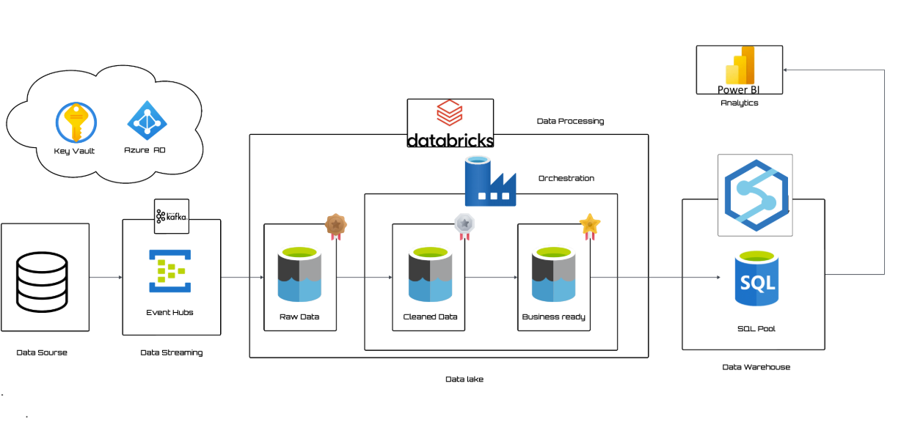
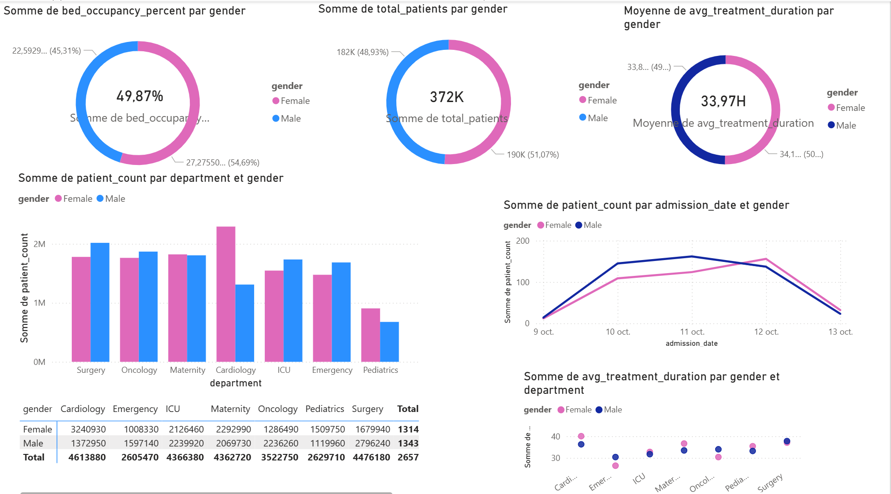

📑 Table des matières

📌 Présentation du projet

🎯 Objectifs

📂 Structure du projet

🛠️ Outils et technologies

📐 Architecture des données

⭐ Modèle en étoile (Star Schema)

⚙️ Mise en œuvre étape par étape

1. Configuration d’Event Hub

2. Simulation des données

3. Configuration du stockage

4. Traitement avec Databricks

5. Pool SQL Synapse

📊 Analyse de données

📌 Présentation du projet

Ce projet présente une pipeline de data engineering en temps réel appliquée au secteur de la santé, visant à analyser le flux des patients à travers les services hospitaliers grâce aux services cloud Azure.
La pipeline collecte les données en continu, les traite avec Databricks (PySpark), et les stocke dans Azure Synapse SQL Pool pour l’analyse et la visualisation.

Partie 1 – Data Engineering : création du pipeline d’ingestion et de transformation en temps réel.
Partie 2 – Analyse : connexion de Synapse à Power BI et conception d’un tableau de bord interactif pour les indicateurs clés hospitaliers.

🏗️ Pipeline

🎯 Objectifs

Collecter des données patients en temps réel via Azure Event Hub.

Nettoyer et transformer les données avec Databricks (couches Bronze → Silver → Gold).

Mettre en place un modèle en étoile dans Synapse SQL Pool pour des requêtes efficaces.

Assurer la gestion de version avec Git.

📂 Structure du projet

├── databricks-notebooks/     # Notebooks de transformation
│   ├── 01_bronze_rawdata.py
│   ├── 02_silver_cleandata.py
│   └── 03_gold_transform.py
├── simulator/                # Scripts de simulation de données
│   └── patient_flow_generator.py
├── sqlpool-quries/           # Scripts SQL pour Synapse
│   └── SQL_pool_quries.sql
└── README.md                 # Documentation du projet

🛠️ Outils et technologies

Azure Event Hub – Ingestion de données en temps réel

Azure Databricks – Traitement ETL basé sur PySpark

Azure Data Lake Storage – Stockage des données brutes et nettoyées

Azure Synapse SQL Pool – Entrepôt de données pour l’analyse

Power BI – Visualisation et tableau de bord

Python 3.9+ – Langage principal

📐 Architecture des données

La pipeline suit une architecture multi-couches :

Couche Bronze : Données brutes JSON issues d’Event Hub, stockées dans ADLS.

Couche Silver : Données nettoyées et structurées (validation des types, gestion des valeurs nulles).

Couche Gold : Données agrégées et prêtes à être utilisées dans Power BI.

⭐ Modèle en étoile (Star Schema)

Les données de la couche Gold dans Synapse suivent un modèle en étoile pour optimiser l’analyse :

Table de faits : FactPatientFlow (visites des patients, temps d’attente, sortie, etc.)

Tables de dimensions :

DimDepartment – Informations sur les services

DimPatient – Données démographiques des patients

DimTime – Dimension temporelle

⚙️ Mise en œuvre étape par étape
1. Configuration d’Event Hub

Création d’un namespace Event Hub et d’un hub “patient-flow”.

Configuration des groupes de consommateurs pour le streaming Databricks.

2. Simulation des données

Développement du script Python patient_flow_generator.py pour générer des données fictives (services, temps d’attente, statut de sortie) et les envoyer à Event Hub.

Code du producteur

3. Configuration du stockage

Mise en place de Azure Data Lake Storage (ADLS Gen2).

Création des conteneurs pour les couches bronze, silver, et gold.

4. Traitement avec Databricks

Notebook 1
 : lecture du flux Event Hub dans la couche Bronze.

Notebook 2
 : nettoyage et validation du schéma.

Notebook 3
 : agrégation et création des tables du modèle en étoile.

5. Pool SQL Synapse

Création d’un pool SQL dédié dans Azure Synapse.

Exécution des scripts SQL pour les tables de faits et de dimensions :

Scripts DDL

📊 Analyse de données

Une fois la pipeline de données établie et le modèle en étoile implémenté dans Synapse SQL Pool, la dernière étape consiste à créer un tableau de bord interactif dans Power BI.

🔗 Connexion Synapse → Power BI

Connexion du pool SQL Synapse à Power BI via une connexion SQL directe.

Importation des tables FactPatientFlow et Dimensions.

Création des relations pour le reporting basé sur le modèle en étoile.

📈 Fonctionnalités du tableau de bord

Le tableau de bord fournit des indicateurs sur :

Le taux d’occupation des lits par service et par genre.

Les tendances du flux de patients (admissions, temps d’attente).

durée de séjour, nombre total de patients ....

✅ Résultats clés

Pipeline complète : de l’ingestion en temps réel jusqu’à la visualisation analytique.

Architecture scalable : facilement adaptable à d’autres jeux de données hospitaliers.

Valeur métier : permet aux administrateurs d’hôpitaux de suivre l’utilisation des lits, le flux des patients et l’efficacité des services.

